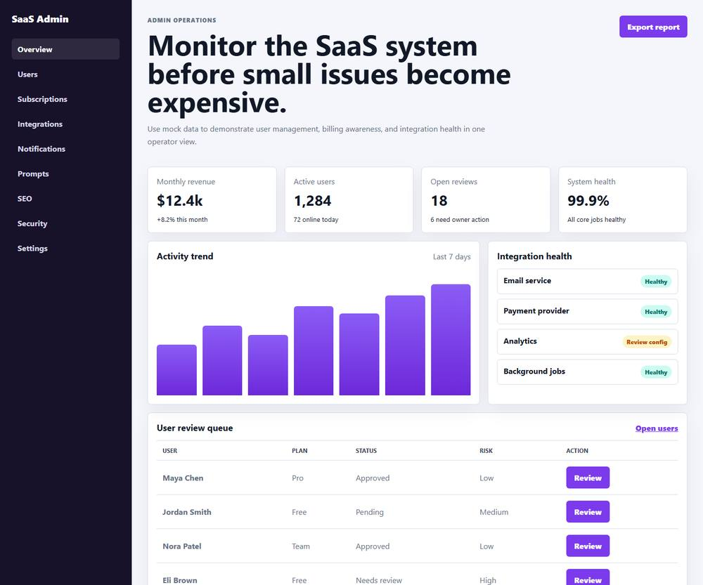

# SaaS Admin Dashboard Template

A public-ready **SaaS admin dashboard template** for operators, founders, and product teams. It demonstrates the core admin workflows expected in a SaaS back office: users, approvals, subscriptions, analytics, integrations, notifications, prompts, content operations, security, and incident monitoring.

This repository uses mock data only. It does not include production credentials, private customer data, payment keys, internal company documents, or copied private Git history.

## Preview



## Feature Coverage

- SaaS admin dashboard overview
- Executive KPI cards
- Activity chart
- User review queue
- Approval, rejection, and review action placeholders
- Subscription status mock
- Payment history mock
- Integration health panel
- Email provider status mock
- Payment provider status mock
- Analytics status mock
- Prompt and template management preview
- SEO/content operations preview
- Marketing offer controls mock
- Notification queue mock
- Security review queue mock
- Site error and incident panel mock
- Data export action placeholder
- Public-safe `.env.example`
- Local quality check for accidental secrets

## Screens Included

- Overview
- Users
- Subscriptions
- Integrations
- Notifications
- Prompt library
- Marketing controls
- SEO/content operations
- Security review
- Site errors

## Deployment Guide

This template is static HTML, CSS, and JavaScript.

### GitHub Pages

1. Create a public GitHub repo.
2. Push this folder.
3. Open **Settings → Pages**.
4. Choose **Deploy from a branch**.
5. Select `main` and `/root`.
6. Save.

### Netlify

1. Create a new site from GitHub.
2. Select this repo.
3. Leave build command empty.
4. Set publish directory to `/`.
5. Deploy.

### Vercel

1. Import this repo.
2. Framework preset: **Other**.
3. Leave build command empty.
4. Output directory: `/`.
5. Deploy.

## Local Preview

Open `index.html` in a browser.

For a local server:

```bash
npx serve .
```

## Safety Check

Run:

```bash
node tools/quality-check.mjs
```

## Suggested GitHub Description

SaaS admin dashboard template with users, subscriptions, analytics, integrations, notifications, prompts, SEO, and security UI.

## Suggested Topics

`saas`, `admin-dashboard`, `dashboard-template`, `user-management`, `subscription-dashboard`, `analytics-dashboard`, `portfolio-project`
